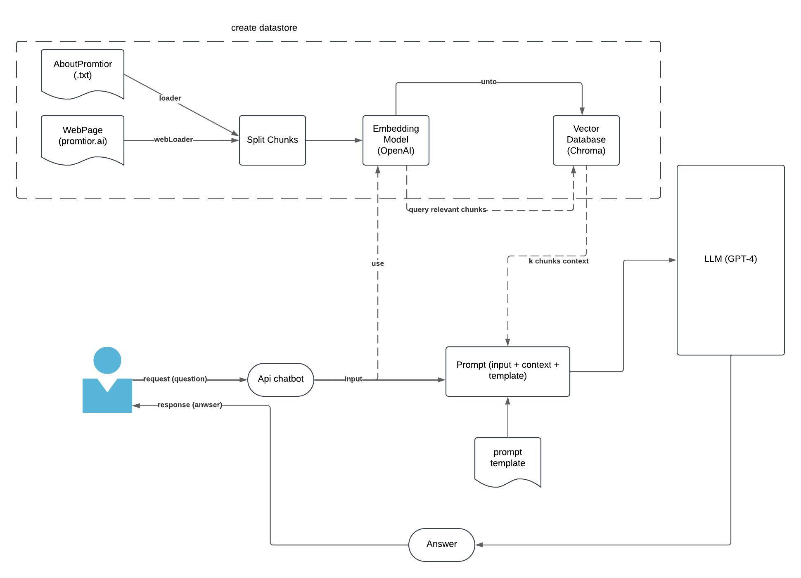

## Desafio Promtior 

Desarrollar e implementar un asistente de chatbot que utilice la arquitectura RAG para responder preguntas sobre el
Contenido del sitio web de Promtior, basado en la biblioteca LangChain.
Puede encontrar información adicional sobre Promtior en esta presentación. Agregarlo como fuente da puntos extra.

El chatbot debería poder responder las siguientes preguntas:
- ¿What services does Promtior offer?
- ¿When was the company founded?

### Diagrama 

## Desarrollo del proyecto

El primer paso fue entender como funciona una arquitectura RAG, sus componentes, y de que manera se relacionan para desarrollar un ChatBot. Para ello me base en la documentacion de langchain y en diversas fuentes mas, estudié las partes involucradas y fui haciendo un pequeño diagrama para guiarme. Una vez en contexto. empecé con el desarrollo del desafio, resolviendo los diferentes problemas a medida que se me presentaban.

## Desafios

### Creación del vector store

Saber la diferencia de guardar la base de datos en memoria o de manera persistente, cual era mas eficiente y por qué. Opté por persistirlo y guardarlo en disco, para que la creación del vectorstore se lo realicé solo una vez y asi evitar reconstruirlo por cada consulta inicial al chatbot. Me pareció una buena solución ya que el contenido que hay en el pdf es estatico, sin embargo hay que tener en cuenta de actualizarlo cuando se realice alguna modificación en la página

### Guardado de documentos y busqueda en el vector store

Entender como se guardan los documentos y cual es la mejor manera de guardarlos. Si es necesario dividirlos en "chunks" y que tamaño debe tener cada uno para tener el mejor resultado a la hora de realizar la busqueda. 
Con respecto al archivo "AIEngineer.pdf", este contenia mucha información irrelevante, como solución separé el contenido sobre Promtior en un archivo .txt separado (aboutPromtior.txt)
Ademas, tuve problemas de rendimiento a la hora de realizar la busqueda con el input "¿What services does promtior offer?". Esto se debiá a que el docuemnto relacionado a la pagina "/services" habia sido guardado en "chunks" demasiados pequeños, lo que causaba tener pedazos de texto sin contexto alguno y retornar resultados pobres (incluso negativos) cuando se realizaba la busqueda. Solución: Al no ser un documento extenso con muchos tokens, lo guardé en el vector store de forma completa

### Elección del modelo de LLM

En primera instancia utilicé Ollama para correr localmente el modelo "Llama 3". Sin embargo, esto generaba tiempos de respuesta muy lentos y complicaciones a la hora de deployar el chatbot. Mi solución fue adquirir una suscripción a la API de OpenAI y utilizar el modelo "GPT 4". Noté resultados muchos mejores en cuanto al tiempo de respuesta como asi tambien a la precisión de las respuestas generadas.

## Tecnologias utilizadas
- Libreria LangChain
- OpenAI y GPT4
- Chromadb
- Docker y Google Cloud Run para el despliegue

